# 자동차 음성제어를 위한 Voice Trigger 모듈 개발

- 사용언어: Python, Tensorflow
- 업무포지션: 팀장
- 투입기간: 2020/09/01 → 2020/11/30

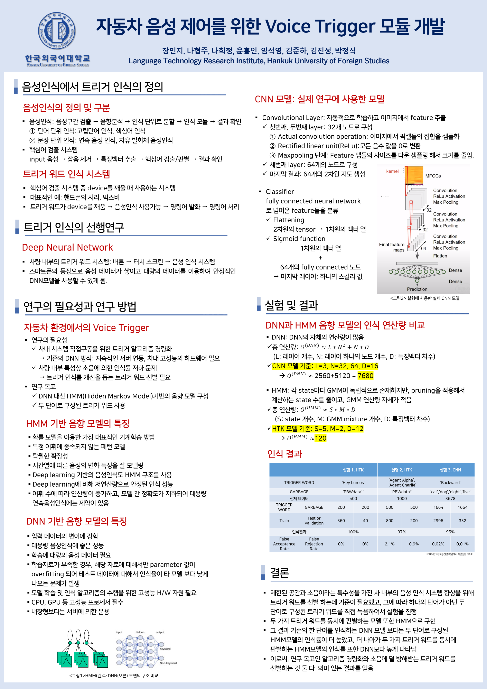

## 👩‍🏫PROJECT 소개

자동차 음성제어를 위한 voice trigger 모듈 개발

Trigger Word를 HTK를 사용한 HMM모델, python을 사용한 CNN 모델로 학습 하고 결과를 비교

🗓️ **작업기간** : 2020.12.

👨‍💻 **투입인원** : 7명

📒 **주요업무** 

- Trigger Word 녹음 및 전처리
- HTK를 사용한 HMM모델 만들기
- Python을 사용하여 CNN 모델 만들기

🌱 **스킬 및 사용툴**

`Python` `HTK` `VisualStudioCode` `AdobeAudition`

## 🖌️Details

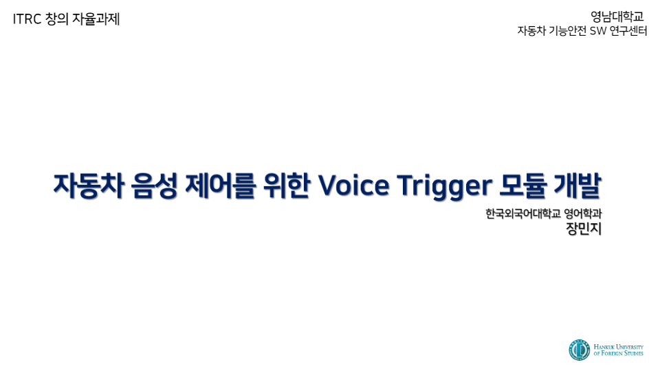

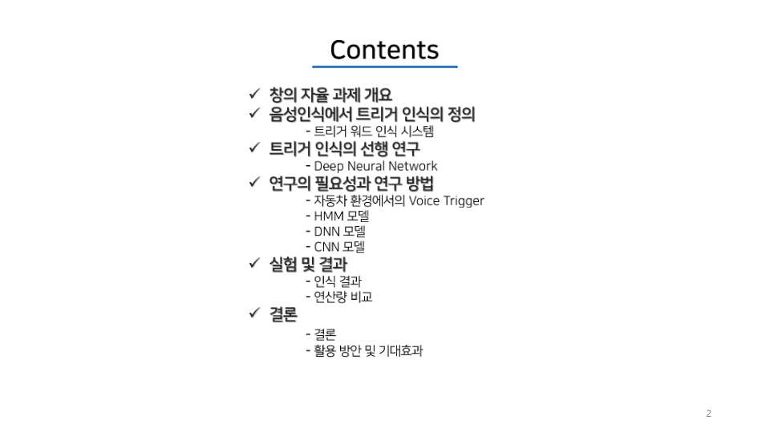

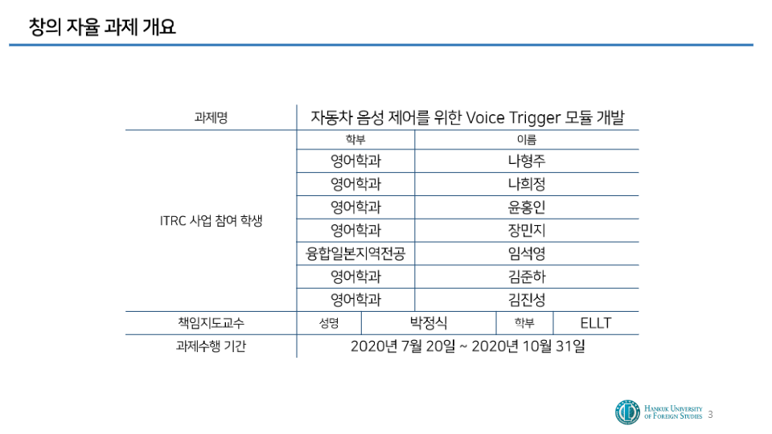

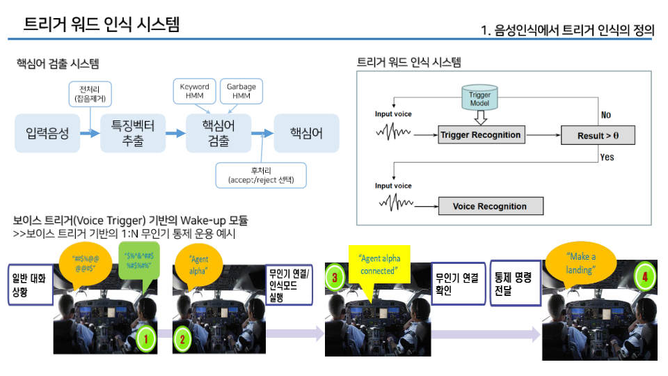

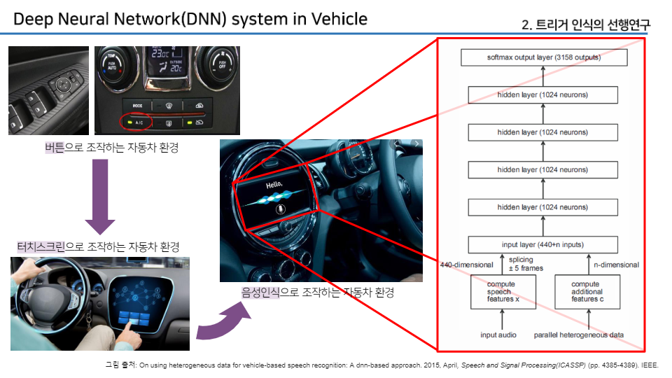

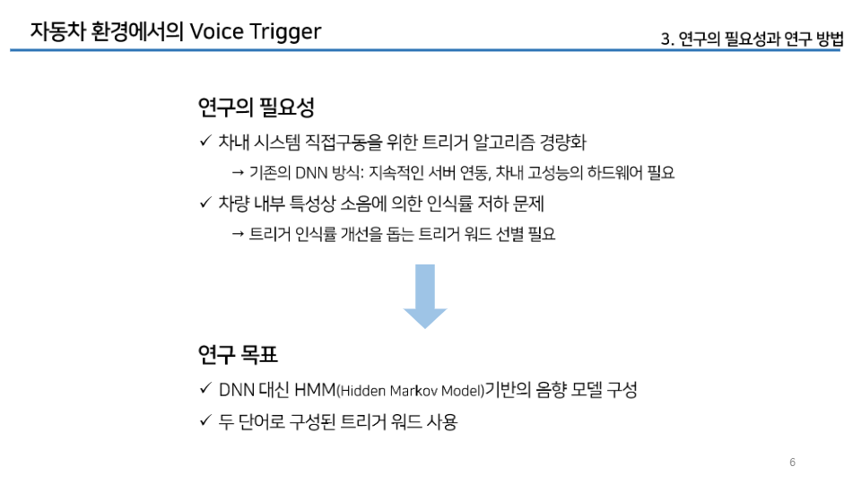

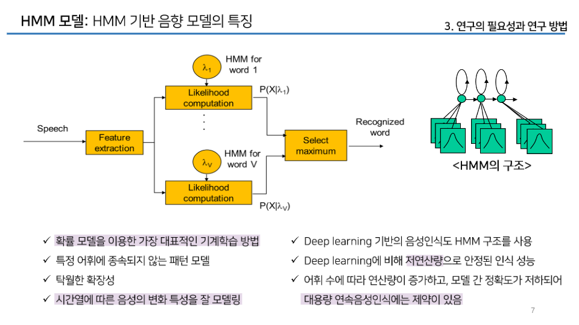

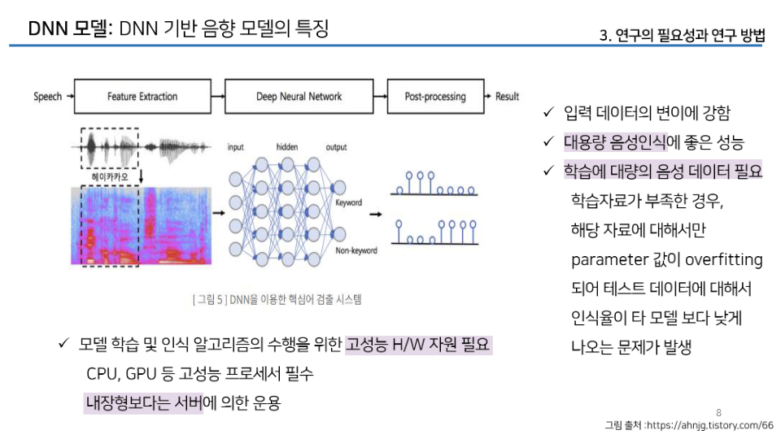

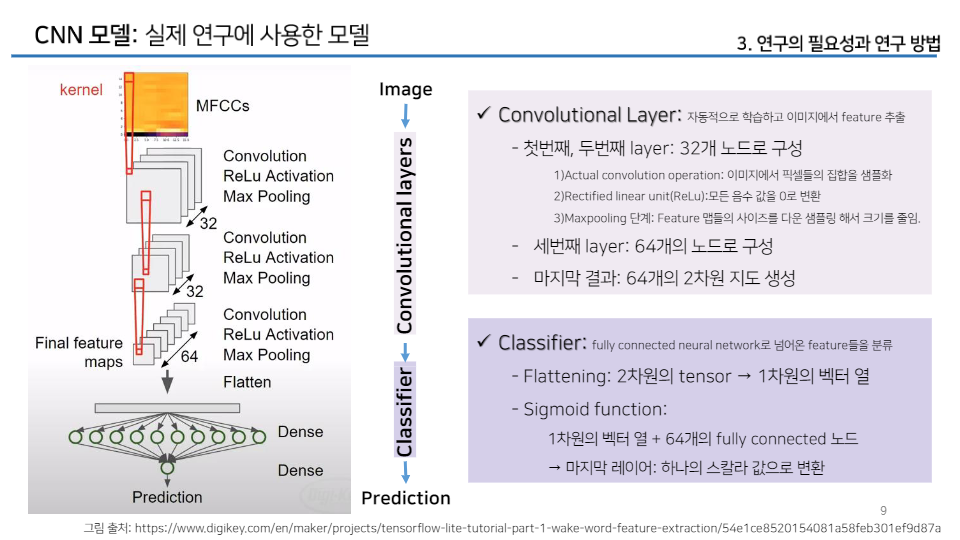

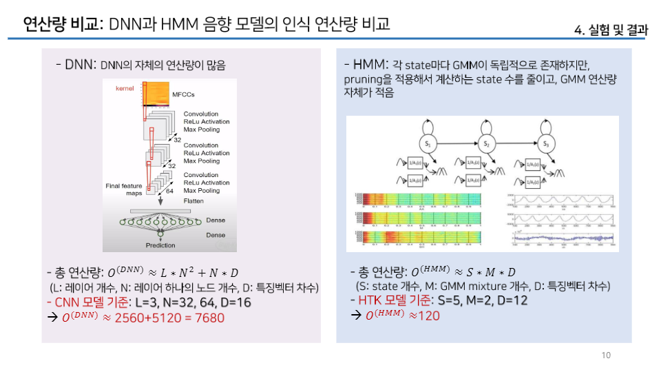

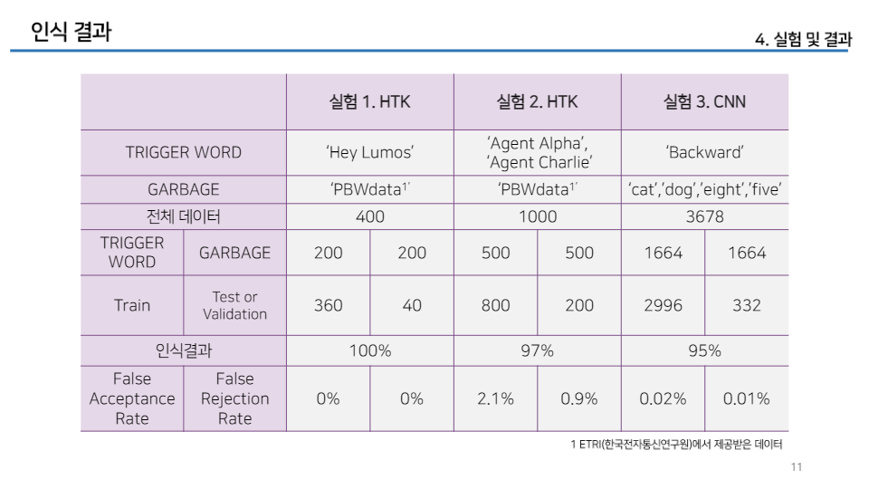

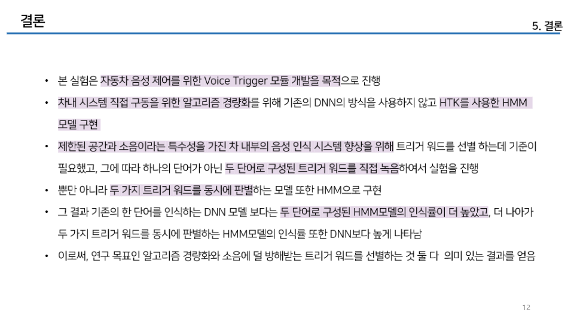

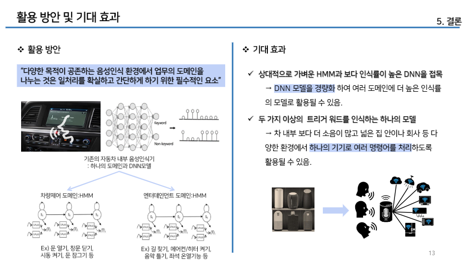
